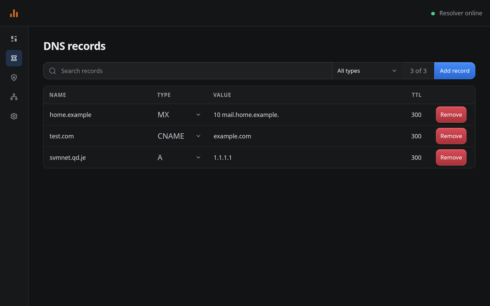

# LightDNS

A small DNS blocker, cache, and authoritative zone manager with a web dashboard.



## Install

Download the latest release from [GitHub Releases](https://github.com/wavedevgit/lightdns/releases):

```sh
# amd64
curl -LO https://github.com/wavedevgit/lightdns/releases/latest/download/lightdns-linux-amd64.tar.gz
curl -LO https://github.com/wavedevgit/lightdns/releases/latest/download/lightdns-linux-amd64.tar.gz.sha256
sha256sum -c lightdns-linux-amd64.tar.gz.sha256
tar -xzf lightdns-linux-amd64.tar.gz
cd lightdns-linux-amd64
sudo ./install.sh
lightdns-run

# arm64: use lightdns-linux-arm64.tar.gz
```

Dashboard: `http://127.0.0.1:8080`

<details>
<summary>Build from source</summary>

```sh
git clone https://github.com/wavedevgit/lightdns.git
cd lightdns
./build.sh
sudo ./install.sh
lightdns-run
```

</details>

## Test DNS

```sh
dig @127.0.0.1 example.com A
```

For a custom port:

```sh
dig @127.0.0.1 -p 1053 example.com A
```

## Configuration

- Base config: `/etc/lightdns/config.yaml`
- SQLite database: `/var/lib/lightdns/lightdns.db`
- Example: [`config.example.yaml`](config.example.yaml)

YAML is imported only when the database is first initialized. SQLite becomes the authoritative source for settings, users, sessions, zones, records, and audit history after that import. Existing `/var/lib/lightdns/state.yaml` files are detected during upgrades and imported before the base config.

The installer securely prompts for the first administrator username and password. Additional users and managed zones are available through the `/api/users` and `/api/zones` management APIs.

For Compose, initialize the database once, remove the password file, and then start the normal service:

```sh
printf '%s' 'replace-with-a-strong-password' > admin-password.txt
chmod 600 admin-password.txt
docker compose --profile setup run --rm lightdns-init
rm admin-password.txt
docker compose up -d lightdns
```

The setup container also imports an existing v1 Compose volume from `/var/lib/lightdns/config.yaml`. That import happens only while creating the SQLite database; subsequent starts use SQLite.

Set `upstreams: []` to answer only custom DNS records. Unknown names return `NXDOMAIN`.

Managed active zones are fully authoritative and return SOA-backed `NXDOMAIN` and `NODATA` responses. Pending, rejected, and suspended zones are not served.

## Build

```sh
go test -race ./...
./build.sh
./package.sh
```

## Security

DNS clients are not filtered by IP inside LightDNS. Restrict public DNS ports with your host or provider firewall. Keep the dashboard on loopback or use HTTPS. Passwords use Argon2id, browser sessions are persisted as token hashes, and the legacy global admin token is not used by the v2 runtime.
